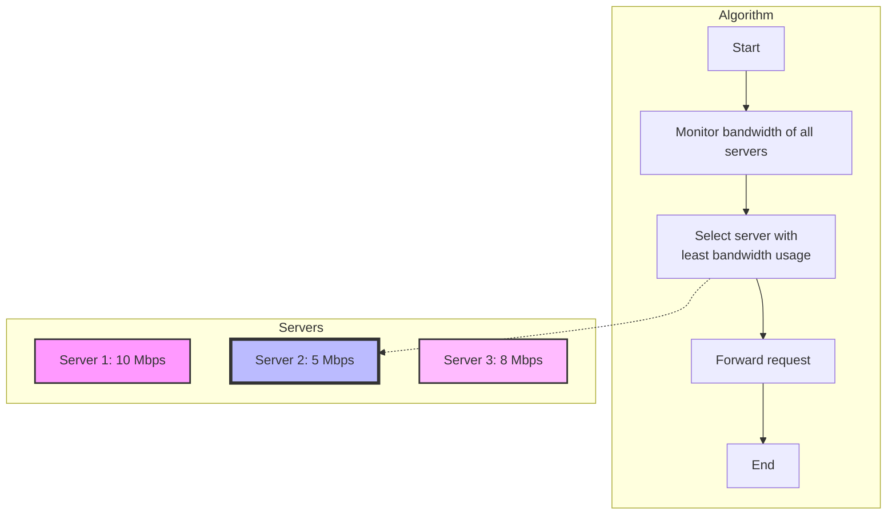
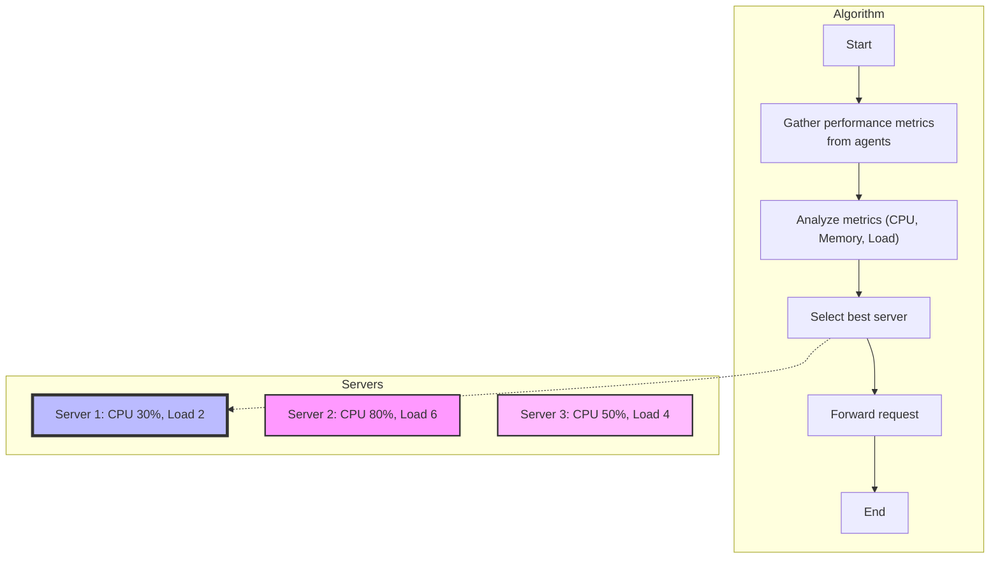
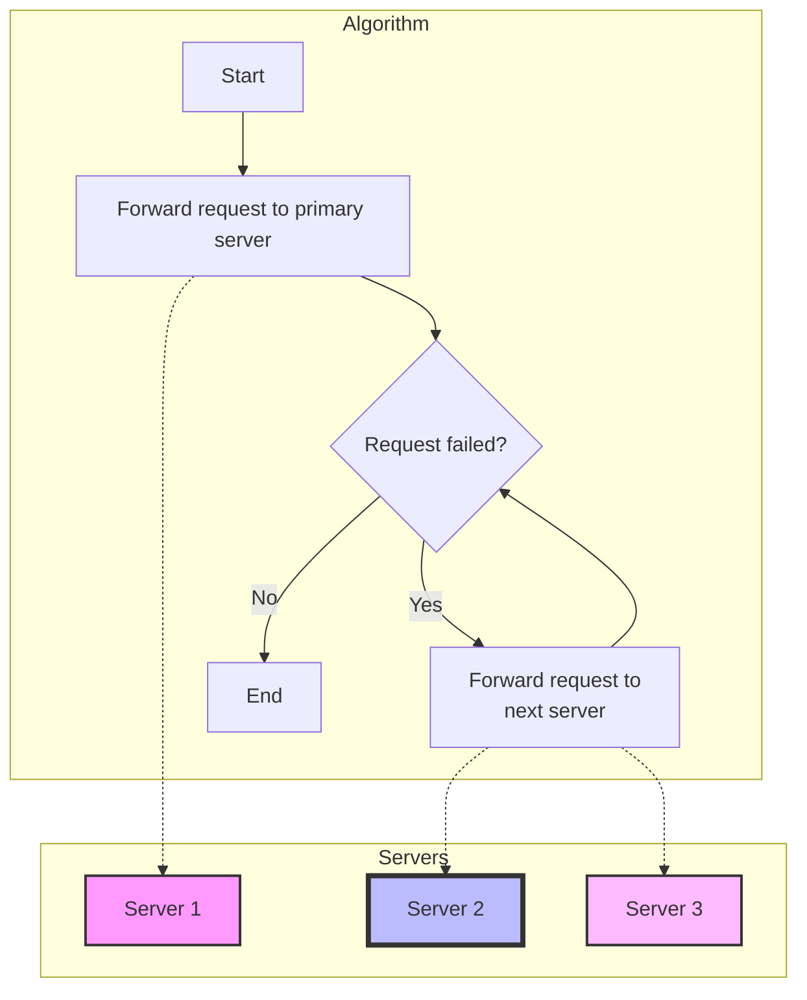
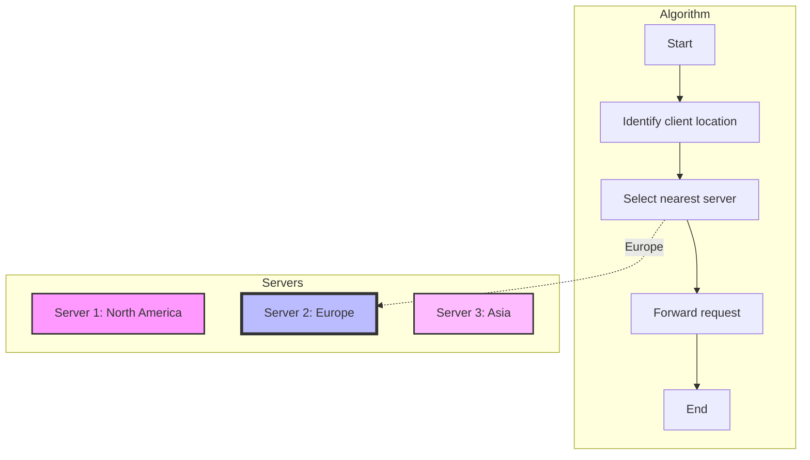
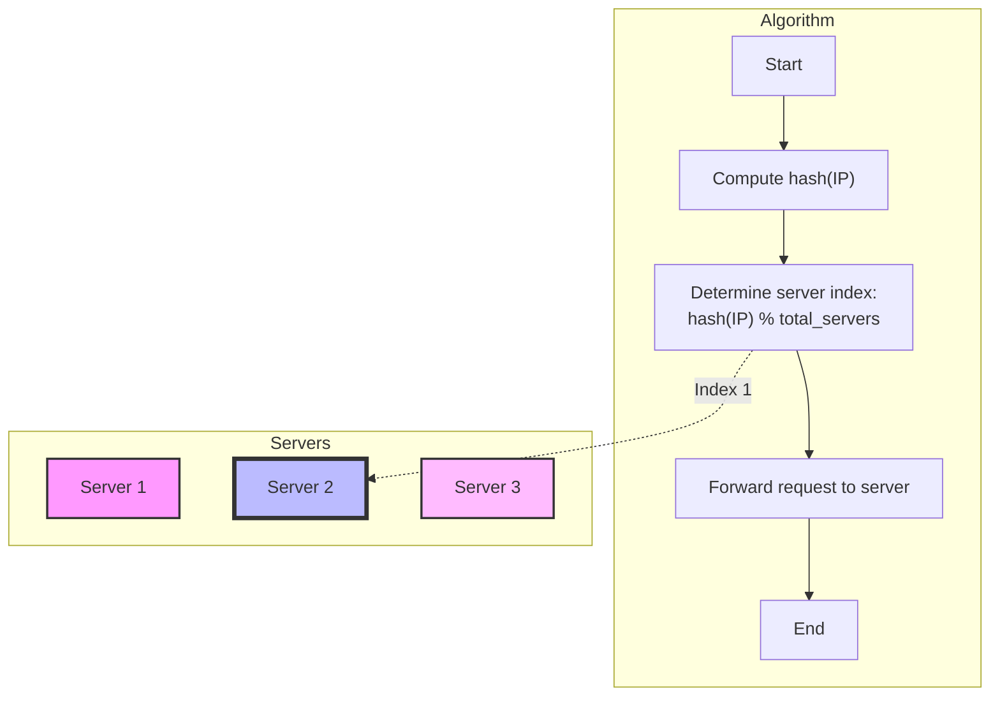
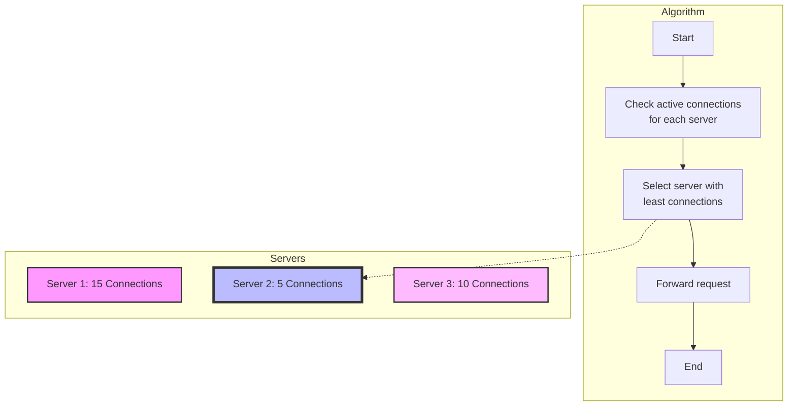
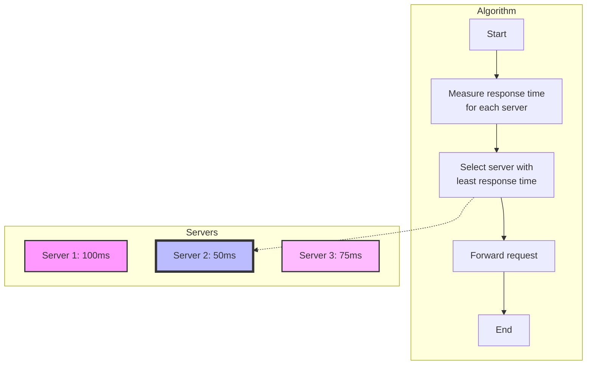
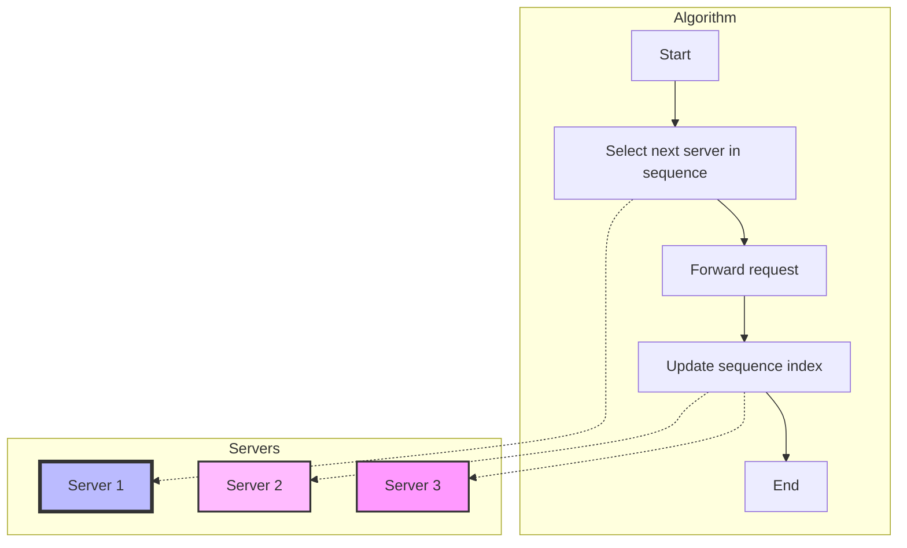
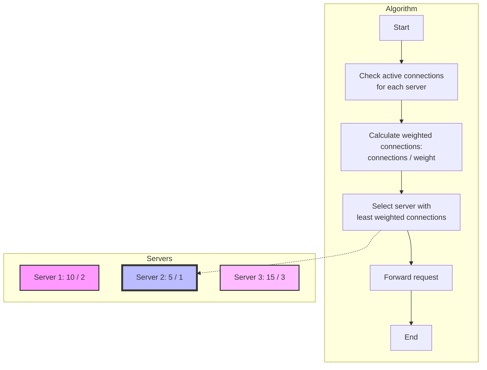
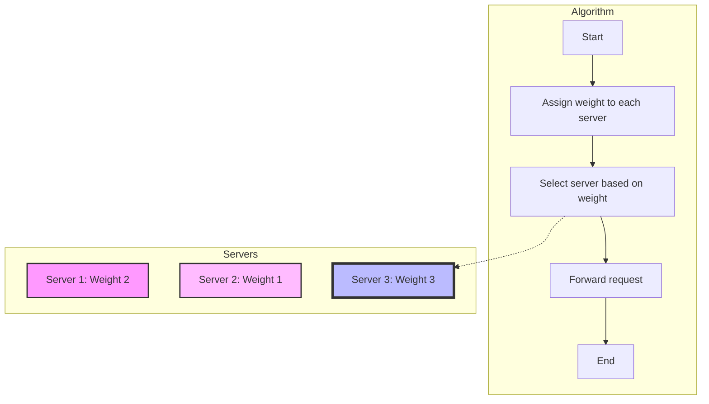

# Visual Guide to Load Balancing Algorithms

This guide provides visual representations of ten fundamental load balancing algorithms using Mermaid charts. Load balancing is essential for distributing incoming network traffic across multiple servers to ensure optimal resource utilization, minimize response time, and prevent overload. Each algorithm has a unique strategy for deciding which server should handle a given request.

## 1. Least Bandwidth

The least bandwidth algorithm forwards requests to the server currently handling the least amount of bandwidth.

## 2. Agent-Based Adaptive Method

This algorithm dynamically adjusts load balancing decisions based on real-time feedback from agents monitoring server performance.

## 3. Chained Failover

The chained failover algorithm sequentially forwards a request to the next available server until a successful response is received.

## 4. Geographic Location-Based

This algorithm forwards a request to the server that is geographically closest to the client.

## 5. IP Hashing

IP hashing uses a hash function on the client's IP address to map each client to a specific server.

## 6. Least Connections

The least connections algorithm forwards a request to the server with the fewest active connections.

## 7. Least Response Time

This algorithm selects the server with the shortest response time for the last few requests.

## 8. Round Robin

Round-robin distributes requests sequentially across all servers in the pool.

## 9. Weighted Least Connections

Weighted least connections takes into account server capacities by using weights when selecting the server with the fewest connections.

## 10. Weighted Round Robin

Weighted round-robin forwards requests based on a predefined weight assigned to each server.

This guide provides a comprehensive overview of the various load balancing strategies, offering a visual approach to understanding the strengths and differences of each method.
